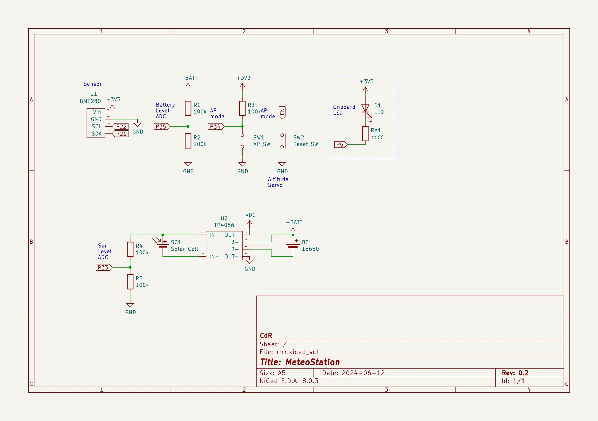

Here we go with weather sensor based on ESP32 SoC.

Board powered by Li-Ion 18650 battery.

BME280 sensor connection: SDA - Pin 21, SCL - Pin 22 (can be configured in espwconst.py)

AP-configuration mode starts automatically, if no config file found or by reset board with lowered Pin 35.
At this mode you can connect to WiFi AP with name like ESP_XXXXX w/o password and set your local WiFi credentials.
Time automatically adjusted with NTP server.

Pin 34 reads adc from 220kOm/220kOm devider between + Li-Ion and GND pin to monitor battery level, Pin 33 monitoring solar power level.

web.py -- simple web server to store data recieved from ESP32 modules and show current values and history graphs.
Storage format: sqlite3.
Data stored by POST requests from ESP32 with data for latest measures
- timedate - UTC time
- ip
- temperature (t)
- humidity (h)
- pressure (p) in hPa
- voltage (v) relative value, must be recalculated to real V. (2420 is near full charge, 1515 -- depleated)a
Measurement performs once per 900 seconds (15 min) and most of time ESP spend in deep-sleep mode.

*Hints.*

mqttudp url: https://mqtt-udp.readthedocs.io/en/latest/

All pins on ESP32 board can be configured by the esp32/espconf.py file.

Connect to board on USB:

```# screen /dev/ttyUSB0 115200```

Run web to get measures (better under screen/tmux):

```
# cd server
# ./start.sh
```

server also have Dockerfile/Makefile to run it in docker container. 


