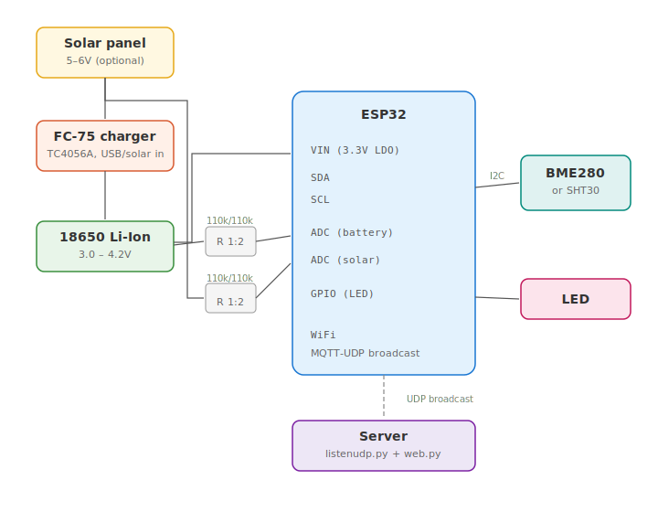

# ESP32 Weather Station

Weather station based on ESP32 with BME280 or SHT30 sensor. Measures temperature,
humidity, pressure (BME280 only) and battery voltage. Data is sent over local network
via **MQTT-UDP** (UDP broadcast, port 1883) and stored in SQLite by the server.

Board is powered by a Li-Ion 18650 battery with optional solar panel charging.

---

## Repository Structure

```
esp32Metheo/
├── esp32/      ← MicroPython firmware
├── espidf/     ← ESP-IDF firmware (C)
└── server/     ← Python server (listenudp.py, web.py, SQLite)
```

---

## Hardware

### Wiring diagram



```
                    ┌─────────────┐
                    │ Solar Panel │ 5-6V (optional)
                    └──────┬──────┘
                           │
                    ┌──────▼──────┐
                    │   FC-75     │ TC4056A Li-Ion charger
                    │  (charger)  │ USB or solar input
                    └──────┬──────┘
                           │
                    ┌──────▼──────┐
                    │ 18650 Li-Ion│ 3.0 - 4.2V
                    └──┬───┬──┬──┘
                       │   │  │
          ┌──────┐     │   │  └──────────────────┐
          │R 1:2 │◄────┘   │              ┌──────▼──────┐
          └──┬───┘         │              │    ESP32    │
             │             │              │             │
       ADC bat────────────►│  3.3V LDO ◄──┤  SDA/SCL ──►BME280/SHT30
                           │              │  GPIO led──►LED
          ┌──────┐         │              │  WiFi ~~~~~~►Server
          │R 1:2 │◄── solar│              └─────────────┘
          └──┬───┘
       ADC solar──────────►┘
```

Without solar panel, the FC-75 charger is still useful for USB charging
and battery protection. Connect battery directly to ESP32 VIN/3.3V.

### Pin connections

```
BME280/SHT30 → ESP32
─────────────────────
VCC    →    3.3V
GND    →    GND
SDA    →    GPIO 21  (configurable)
SCL    →    GPIO 22  (configurable)

BME280 only:
  SDO  →    GND       ← I2C address 0x76
  CSB  →    3.3V      ← force I2C mode

SHT30:
  I2C address 0x44 (default)
```

### Voltage dividers

Battery and solar voltage exceed ESP32 ADC range (max 3.3V),
so a resistor divider (1:2 ratio) scales them down:

```
BAT(+) → R1(110k) → ADC pin → R2(110k) → GND
```

With 110k/110k divider, 4.2V battery reads as ~2.1V on ADC.
Same circuit for solar panel if enabled.

All ADC pins configurable via menuconfig (GPIO 32-39, ADC1 only).

### LED indicator

```
GPIO → 220Ω resistor → LED(+) → LED(-) → GND
```

Some boards (e.g. TTGO) have active-low LEDs — use `LED_INVERTED` option.

---

## Firmware: ESP-IDF (C) — `espidf/`

Full-featured firmware using ESP-IDF framework:

* **Sensor auto-detection** — probes SHT30 (0x44) first, falls back to BME280 (0x76)
* Deep sleep between measurements (configurable, 15 min default)
* Timestamps assigned by server (no NTP dependency on device)
* **Wi-Fi configuration via captive portal** — AP mode on first boot, runs until configured
* Device ID from MAC address
* Automatic AP mode after repeated connection failures
* **Low battery detection** — `lbat:1` flag when voltage below configurable threshold
* **Hardware watchdog** — 90s timeout, reboots if firmware hangs
* **Reset reason** reported in config packet (power/sleep/wdt/brownout/panic)
* **Device config broadcast** — periodic JSON to `weather/<id>/config` topic
* Optional solar panel voltage monitoring
* All GPIO pins and timings configurable via `idf.py menuconfig`

### Building

```bash
cd espidf
idf.py menuconfig   # configure pins, sleep time, sensor type, etc.
idf.py build
idf.py flash monitor
```

### Configuration (`idf.py menuconfig`)

Under **Weather Station Configuration**:

| Option | Default | Description |
|--------|---------|-------------|
| Deep sleep interval | 15 min | Time between measurements (1-60 min) |
| Config broadcast interval | 24 boots | How often to send device config (~6h at 15min sleep) |
| LED GPIO pin | 5 | Status LED pin |
| LED inverted | no | Active-low LED (some boards like TTGO) |
| I2C SDA GPIO | 21 | I2C data pin |
| I2C SCL GPIO | 22 | I2C clock pin |
| Wi-Fi failures before AP | 5 | Consecutive failures before AP mode |
| Battery ADC GPIO | 34 | Battery voltage divider pin (GPIO 32-39) |
| Low battery threshold | 3300 mV | Voltage below which `lbat:1` is sent |
| Sensor type | Auto-detect | Auto (SHT30 → BME280), BME280 only, SHT30 only |
| Solar panel enabled | yes | Enable solar voltage measurement |
| Solar ADC GPIO | 33 | Solar panel voltage divider pin (GPIO 32-39) |

### First boot / Wi-Fi setup

On first boot (or when no credentials are stored), the device starts
an open Wi-Fi access point named **Metheo_XXXXXX** (last 6 chars of MAC).
Connect to it and open `http://192.168.4.1` to enter Wi-Fi credentials.
LED blinks rapidly in AP mode.

AP mode runs indefinitely until credentials are submitted — no timeout.
After successful configuration, the device reboots and connects to Wi-Fi.

If connection fails, the AP page will show the SSID and password that
were used, so you can spot typos.

### Erasing stored credentials

To reset Wi-Fi credentials and force AP mode:

```bash
idf.py erase-flash
idf.py flash
```

---

## Firmware: MicroPython — `esp32/`

Original MicroPython firmware (legacy):

* AP configuration mode on first boot
* SHT30 / BME280 auto-detection
* Batch upload of accumulated measurements (buffered during Wi-Fi outage)
* Solar panel voltage monitoring on GPIO 33
* All pins configurable via `espconf.py`

---

## Data Format

### Sensor data

ESP-IDF sends MQTT-UDP packets to topic `weather/<device_id>`:

```json
{"t":21.9,"h":24.7,"p":976.6,"v":3.85,"vs":4.12}
```

MicroPython sends with device timestamp (used for batch dedup):

```json
{"ts":"2026-04-17 12:00:00","t":21.9,"h":24.7,"p":0,"v":2307,"vs":962}
```

Timestamp is assigned by the server upon receipt (UTC). MicroPython device
timestamps are used only as primary key for batch upload deduplication.

| Field | Description | Unit | Notes |
|-------|-------------|------|-------|
| `t` | Temperature | °C | |
| `h` | Humidity | % | |
| `p` | Pressure | hPa | 0 / None for SHT30 |
| `v` | Supply voltage | V (ESP-IDF) / raw ADC (MicroPython) | |
| `vs` | Solar voltage | V / raw ADC | omitted if solar disabled |
| `lbat` | Low battery flag | — | ESP-IDF only, when voltage below threshold |

### Device config

ESP-IDF periodically broadcasts config to `weather/<device_id>/config`:

```json
{"fw":"espidf","sensor":"BME280","sleep":15,"led":5,"led_inv":0,
 "i2c_sda":21,"i2c_scl":22,"bat_gpio":34,"lowb":3300,"solar":0,"rst":"sleep"}
```

Config is stored in `params` table and displayed in the web interface footer.

---

## Server

```bash
cd server
./start.sh
```

* **`listenudp.py`** — MQTT-UDP listener, stores sensor data and device config to per-device SQLite databases. Server-side timestamps (UTC). Smart deduplication: MicroPython batch packets use device `ts`, ESP-IDF uses 30s dedup window.
* **`web.py`** — web interface (aiohttp):
  * **Index page** — sensor cards with current readings, color-coded indicators, "ago" time, offline detection
  * **Graph page** — current values + dygraph history charts, date range picker, auto-refresh countdown
  * **Weather forecast** — simple barometric forecast based on 6-hour pressure and humidity trends
  * **CSV endpoint** — data export for graphs
* Docker support via `Dockerfile` / `Makefile`

### Web interface features

* Color-coded readings: temperature (cold/ok/hot), humidity (dry/ok/wet), battery (ok/warn/low)
* Indicator symbols: ● normal, ▲ high, ▼ low
* Low battery warning (⚠) based on device-reported threshold
* Offline detection when device silent > 2.5× sleep interval
* Device config footer (firmware, sensor, GPIO pins, reset reason)
* Responsive design, works on mobile

More info: [MQTT-UDP](https://mqtt-udp.readthedocs.io/en/latest/)
